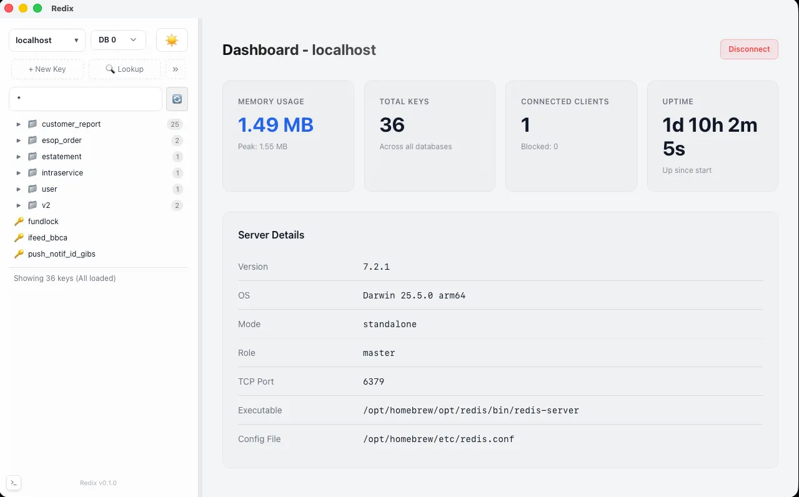
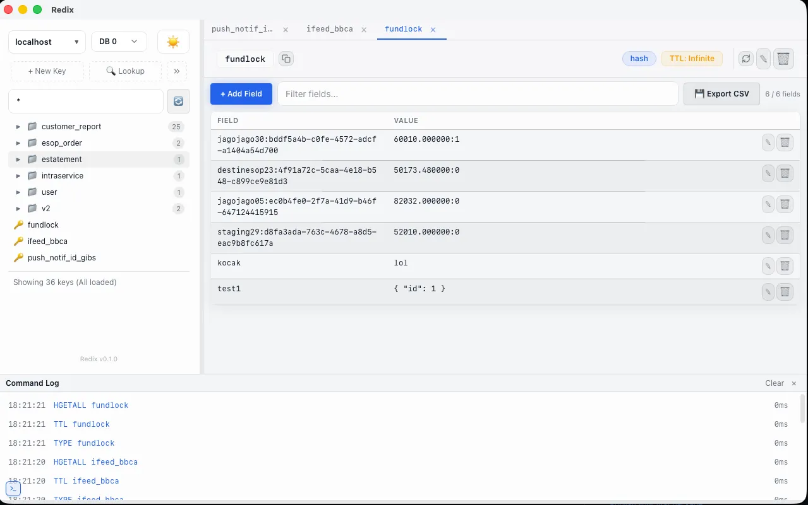

<div align="center">
  
  <h1>Redix</h1>
  <p><strong>The next-generation Redis GUI for power users.</strong></p>
  <p>Fast, elegant, and lightweight. Built with Tauri v2, Rust, and Svelte 5.</p>
</div>

---

## 🚀 Overview

**Redix** is a modern desktop visualizer and manager for your Redis databases. Unlike bloated electron-based database managers, Redix leverages the power of **Tauri** and **Rust** to provide a blazing fast native experience while sporting a premium "Deep Dark Glassmorphism" UI built with Svelte 5.

## 📸 Screenshots





## ✨ Features

- **Modern & Premium UI:** Deep dark glassmorphism aesthetic with slick animations and micro-interactions. Includes a Light Mode toggle.
- **Tabbed Interface:** Work on multiple keys at once. Double-click any key from the sidebar to open it in a new, fully interactive tab.
- **Advanced Key Tree:** Visualize deeply nested Redis keys (`user:profile:123`) in an intuitive tree structure.
- **Support for All Data Types:** Rich, editable viewers for Strings, Hashes, Lists, Sets, and Sorted Sets. (Includes JSON auto-formatting).
- **Interactive Command Log / Console:** Open the bottom console to monitor commands executed by the app in real-time (with duration metrics), or type raw Redis commands directly!
- **Cross-Platform:** Available and highly optimized for macOS, Windows, and Linux.

### 🔥 Advanced Power Tools

Redix comes loaded with enterprise-grade features out of the box. Check out our **[Advanced Features Guide](docs/advanced-features.md)** for more details on:
* **📡 Live Pub/Sub Viewer**
* **🧠 Redis Memory Analyzer (Top Keys Scanner)**
* **🐌 Slow Log Profiler**
* **💾 Two-Way Data Import & Export (CSV)**
* **⏱️ Live TTL Monitoring**

## 🛠️ Tech Stack

- **Frontend:** [Svelte 5](https://svelte.dev/) + [Vite](https://vitejs.dev/)
- **Backend / Desktop Bridge:** [Tauri v2](https://tauri.app/) + [Rust](https://www.rust-lang.org/)
- **Package Manager:** [Bun](https://bun.sh/)

## 📦 Download & Install

Check out the [Releases](https://github.com/luqmannulhakim/redix/releases) page to download the latest `.exe` (Windows), `.dmg` (macOS), or `.deb`/`.AppImage` (Linux) installers.

*Note: GitHub Actions automatically build the installers on every release tag.*

## 💻 Development Setup

If you want to build or contribute to Redix locally, follow these steps:

### Prerequisites
1. Install **Bun**: [bun.sh](https://bun.sh/)
2. Install **Rust**: [rustup.rs](https://rustup.rs/)
3. (Linux only) Install Tauri OS dependencies: `sudo apt install libwebkit2gtk-4.1-dev libappindicator3-dev librsvg2-dev patchelf`

### Running the App Locally

1. Clone the repository:
   ```bash
   git clone https://github.com/luqmannulhakim/redix.git
   cd redix
   ```
2. Install frontend dependencies:
   ```bash
   bun install
   ```
3. Run the development server (starts Vite and the Tauri Rust window):
   ```bash
   bun tauri dev
   ```

### Building for Production

To build the production installers for your current operating system:
```bash
bun tauri build
```
*The compiled installers will be available in `src-tauri/target/release/bundle/`.*

## 🛑 Troubleshooting

### macOS: "Redix is damaged and can't be opened"

If you download the application outside the Mac App Store and see an error saying the app is damaged and should be moved to the Trash, this is macOS Gatekeeper putting the app in quarantine because it is unsigned.

**To fix this:**

1. Move the `Redix.app` to your **Applications** folder.
2. Open the **Terminal** app.
3. Run the following command to remove the quarantine attribute:
   ```bash
   xattr -cr "/Applications/Redix.app"
   ```
4. Double-click the app to open it normally.

---
*Crafted with ❤️ for Redis Developers.*
